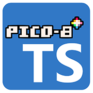
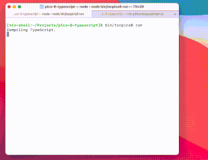

# TS-PICO-8 - TypeScript for PICO-8



Create [PICO-8](https://www.lexaloffle.com/pico-8.php) games in TypeScript!

TS-PICO-8 contains all the function declarations (`.d.ts`) for the PICO-8 API
and will compile your TypeScript code to Lua and inject it into your PICO-8 cart.

Compression and mangling options are configurable to optimize for token usage, and
an external spritesheet allows you to easily manipulate sprites using the image
editor of your choice (i.e., aseprite).

PICO-8 is restarted automatically whenever new changes are detected to provide you
with a seamless workflow.

I believe this is the first project to provide an entry point into
using a typed language with PICO-8.



## Installation and usage

### Prerequisites

1. Install a recent version of PICO-8
2. Install a recent version of NodeJS
3. Clone this repository to your local machine
4. Install dependencies `npm install`
5. Make sure "$PWD/node_modules/.bin/" is in your $PATH.

### Create a PICO-8 project

1. Run `bin/tspico8.js init` to generate the default workspace `p8workspace`.
2. Optionally configure `p8workspace/tspico8.json` to specify compression, mangling, and pico-8 location. Note: tspico8 will attempt to detect the pico-8 location automatically.
3. Run `bin/tspico8.js run` to watch for changes inside of `p8workspace` and recompile/relaunch when detected.

### Configuration (tspico8.json)

```
{
  // Set this if tspico8 can't find your pico-8 install automatically
  "pico8": {
    "executable": "path/to/pico8/executable/file"
  },
  "compression": { 
    "compressedFile": "build/compressed.js",
    "indentLevel": 1,
    "compress": false, // enable compression
    "mangle": false // enable mangling (shortens variable names)
  },
  // Configure mangling
  // See: https://github.com/mishoo/UglifyJS#mangle-options
  "mangleOptions": {
    "toplevel": true,
    "reserved": ["_init", "_update", "_draw"]
  },
  // Configure compression
  // See: https://github.com/mishoo/UglifyJS#compress-options
  "compressOptions": {
    "dead_code": true,
    "conditionals": false,
    "comparisons": true,
    "evaluate": true,
    "booleans": true,
    "loops": true,
    "unused": true,
    "join_vars": true
  }
}
```

### Notes on compilation, compression and mangling

This project is basically a [Rube Goldberg machine](https://en.wikipedia.org/wiki/Rube_Goldberg_machine), and the build process is very brittle. Getting from TypeScript to
Lua is accomplished as follows.

1. A file watcher (chokidar) watches `p8workspace` for any changes to `*.ts` or `spritesheet.png`.
2. When a change is detected, `tsc` is invoked and the resulting JavaScript dumps to `p8workspace/build/compiled.js`.
3. The `compiled.js` is fed into uglify with the params provided in `tspico8.json`
 to produce a compressed JavaScript file `p8workspace/build/compressed.js`.
4. The compressed JavaScript file is then fed to a PICO-8 specific JavaScript to Lua compiler (jspicl-cli) that does something very close to a one-to-one translation and assembles the final cart.

The PICO-8 Lua interpreter is somewhat limited compared to modern Lua, so there are a lot of
scenarios where unexpected output from any stage of this process can break your cart.

You will achieve the most stable results by leaving `compress` and `mangle` set to `false` in the
`tspico8.json` file, which is the default. That said, experimenting with `compress` and `mangle`
can allow you to achieve a substantial savings in your cart size.

USE THEM AT YOUR OWN RISK :-)

### Workflow (after workspace init)

1. Run `bin/tspico8.js run`.
2. Modify `p8workspace/main.ts` and PICO-8 will restart upon every file save.
3. Modify `p8workspace/spritesheet.png` and PICO-8 will restart upon every file save.
4. Spritesheet colors should be limited to the PICO-8 color palette.
5. If you want to use the PICO-8 sprite editor, you'll need to dump its sprite sheet after
making changes (`export spritesheet.png` from inside of PICO-8).
6. Any other changes made inside of PICO-8 should be saved back to the cart `game.p8` before
recompiling, or they will be overwritten.
7. If you want to use multiple TypeScript files, [read this first](https://github.com/scambier/tic80-typescript/issues/9).

### Commands

    # builds bin/tspico8.js from typescript
    npm run build-bin
    # creates project skeleton inside of p8build
    bin/tspico8.js init
    # watches for changes and reloads PICO-8 on recompile
    bin/tspico8.js run

### Spritesheet hack (requires seperate Imagemagick install)
    # Use imagemagick to remap a 128x128 spritesheet to the PICO-8 color map (included in repo)
    $ convert newsheet.png -dither none -remap pico-8-8x.png spritesheet.png

### Credits

1. Most of the code is adapted/borrowed from [tic80-typescript](https://github.com/scambier/tic80-typescript).
2. The [jspicl](https://github.com/jspicl/jspicl) JavaScript to PICO-8 Lua compiler does a lot of
the heavy lifting behind the scenes.

Thanks to these projects!
